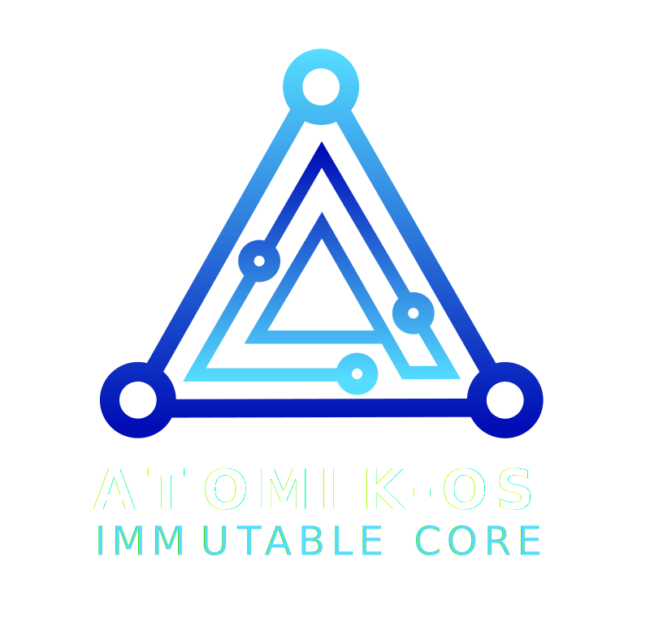

<p align="center">
  
</p>

<p align="center">
  <strong>Distribuzione Linux immutabile · Fedora Silverblue · Niri · DankMaterialShell</strong>
</p>

---

# Atomik OS

Distribuzione Linux immutabile basata su **Fedora Silverblue**, con compositor **Niri** e shell **DankMaterialShell (DMS)** forzati su tutte le varianti.

## Varianti

| Variante | Base | Uso | Stato |
|---|---|---|---|
| `desktop` | F43 | Workstation minimalista + sviluppo | ✅ Disponibile |
| `puregaming` | `atomik-desktop` | Gaming puro su base desktop | ✅ Disponibile |
| `desktop-nvidia` | F43 + driver NVIDIA | Workstation con GPU NVIDIA | ✅ Disponibile - BETA |
| `puregaming-nvidia` | `desktop-nvidia` + driver NVIDIA | Gaming con GPU NVIDIA | ✅ Disponibile - BETA |

`puregaming` eredita interamente da `desktop`: tutto ciò che è nella base (Niri, DMS, greetd, ujust, Brave, Bazaar) è presente anche in gaming.

## Benchmark

Confronto su stesso hardware (AMD Ryzen 5 7530U, 14 GB RAM) tra **Atomik OS Desktop** e **Fedora Silverblue 44** stock.

| Metrica | Fedora Silverblue 44 | Atomik OS Desktop | Vincitore |
|---|---|---|---|
| RAM idle | 1752 MB | **1607 MB** | ✅ Atomik (−145 MB) |
| Boot totale | N/A | 51.857s | — |
| Boot kernel | 9.749s | **0.850s** | ✅ Atomik (11× più veloce) |
| Boot initrd | 45.939s | **5.439s** | ✅ Atomik (8× più veloce) |
| Boot userspace | 52.130s | **14.178s** | ✅ Atomik (3× più veloce) |
| CPU single | 2398 e/s | **3514 e/s** | ✅ Atomik (+46%) |
| CPU multi | 27098 e/s | **25854 e/s** | ≈ pari |
| Mem read | 2249 MiB/s | 2238 MiB/s | ≈ pari |
| Mem write | 2210 MiB/s | 2213 MiB/s | ≈ pari |
| Disco seq read | **1006 MB/s** | 1013 MB/s | ≈ pari |
| Disco seq write | 399 MB/s | **407 MB/s** | ✅ Atomik |
| Disco rand read | **35262 IOPS** | 34531 IOPS | ≈ pari |
| Disco rand write | 122683 IOPS | **118100 IOPS** | ≈ pari |
| GPU glmark2 | **2532** | 1937 | Silverblue (F44 vs F43) |
| Pacchetti installati | 1537 | 1669 | — |

> I benchmark sono stati eseguiti con [atomik-bench](tools/atomik-bench), lo strumento di benchmark universale incluso nel repo.
> Il vantaggio GPU di Silverblue è atteso: usa F44 con driver più recenti. Sarà colmato con la migrazione ad F44.

## Installazione

### Da ISO (consigliato)

Le ISO vengono generate dal workflow **Build Atomik OS ISO** (Actions → Run workflow → scegli la variante) e pubblicate su storage S3.

Il flusso di installazione:

1. Avvii l'installer (Anaconda) e completi l'installazione interattiva: lingua, **tastiera**, disco, utente.
2. Al **primo boot** il sistema passa automaticamente all'immagine Atomik della variante scelta e riavvia.
3. Al **secondo boot** sei su Atomik OS. Le app Flatpak vengono scaricate in background (vedi *Primo avvio*).

### Da rebase

Per passare ad Atomik OS da un sistema Fedora Atomic / bootc esistente:

```bash
# Variante desktop
sudo bootc switch ghcr.io/giurest/atomik-desktop:latest

# Variante gaming
sudo bootc switch ghcr.io/giurest/atomik-puregaming:latest
```

Poi `sudo reboot`.

## Primo avvio

Al primo boot un servizio installa automaticamente le app Flatpak da Flathub (richiede connessione di rete e qualche minuto). Non serve lanciare comandi manualmente.

> **Importante**: le app Flatpak vengono installate *mentre la sessione è già attiva*, quindi il launcher di DMS potrebbe non mostrarle subito. Una volta completato il download, esegui un **restart di DMS** per farle comparire:
>
> ```bash
> dms restart
> ```
>
> (oppure usa la voce "Riavvia DMS" dal menu di DMS). È necessario una sola volta, al primissimo avvio di un sistema nuovo.

## Comandi di sistema (ujust)

Atomik include `ujust`, un set di comandi per le operazioni comuni. Esegui `ujust` senza argomenti per la lista completa. Tra le ricette disponibili:

```bash
ujust create-user      # crea un nuovo utente
ujust update           # aggiorna il sistema (bootc upgrade)
ujust status           # stato dell'immagine bootc
ujust rollback         # torna all'immagine precedente
ujust set-wallpaper    # imposta lo sfondo Atomik
```

## Software incluso

### Base (Desktop — presente su tutte le varianti)

- **Compositor**: Niri (sessione di default)
- **Shell desktop**: DankMaterialShell (DMS) + dms-greeter
- **Login**: greetd con dms-greeter
- **Terminale**: Alacritty + Fish + Starship
- **File manager**: Nautilus
- **Tema**: Papirus icons
- **Boot**: Plymouth con tema Atomik
- **Browser**: Brave NATIVO Debloated
- **Store app**: Bazaar (Flatpak) — per installare facilmente altre applicazioni
- **Utility Flatpak**: Flatseal, Telegram
- **CLI**: eza, bat, ripgrep, fd, htop, fastfetch
- **Container**: podman, podman-compose, distrobox

### PureGaming (in aggiunta alla base)

- **Tool di sistema**: MangoHud, GameMode (via RPMFusion)
- **Client di gioco** (RPM): Steam, Lutris, (Flatpak) Heroic
- **Comunicazione** (Flatpak): Discord, TeamSpeak3
- **Ottimizzazioni**: sysctl gaming (swappiness, max_map_count)

## Installare altre app

Usa **Bazaar** (lo store grafico) per installare qualsiasi altra applicazione Flatpak da Flathub, senza modificare l'immagine. In alternativa, da terminale:

```shell
flatpak install flathub <app-id>
```

## Benchmark tool

Il repo include [atomik-bench](tools/atomik-bench), una suite di benchmark leggera e universale per confrontare Atomik OS con altre distribuzioni sullo stesso hardware.

```bash
# Esegui benchmark (funziona su qualsiasi distro Linux)
curl -fsSL https://raw.githubusercontent.com/giurest/atomik-os/main/tools/atomik-bench | bash

# Confronta due risultati
./tools/atomik-bench-compare risultato1.json risultato2.json
```

## Struttura repo

```
atomik-os/
├── .github/workflows/
│   ├── build.yml          # Build immagini OCI → ghcr.io (desktop + derivate)
│   └── iso-manual.yml     # Genera ISO per variante (workflow_dispatch)
├── containerfiles/
│   ├── Containerfile.desktop          # base (FROM F43 Silverblue)
│   ├── Containerfile.puregaming       # FROM atomik-desktop
│   ├── Containerfile.desktop-nvidia   # base (FROM F43 Silverblue + driver NVIDIA)
│   └── Containerfile.puregaming-nvidia # FROM atomik-desktop-nvidia
├── installer/
│   ├── atomik-desktop.toml
│   ├── atomik-puregaming.toml
│   ├── atomik-desktop-nvidia.toml
│   └── atomik-puregaming-nvidia.toml
├── files/
│   ├── branding/          # Logo SVG e PNG (dark/light, icone, wallpaper)
│   ├── niri/              # config Niri di sistema
│   ├── plymouth/atomik/   # tema Plymouth
│   ├── fastfetch/         # config fastfetch per variante
│   ├── ujust/             # justfile con i comandi di sistema
│   ├── skel/              # skel utenti (autostart wallpaper)
│   ├── backgrounds/       # wallpaper di sistema
│   ├── dms/               # file DMS personalizzati (SystemLogo.qml)
│   └── system/            # file copiati nel sistema
└── tools/
    ├── atomik-bench        # suite benchmark universale
    └── atomik-bench-compare # confronto risultati benchmark
```

## Build locale (opzionale)

```shell
# Richiede podman o buildah — non è possibile sviluppare al di fuori di una distro bootc
buildah build -f containerfiles/Containerfile.desktop -t atomik-desktop:local .
```

> Nota: `Containerfile.puregaming` parte da `ghcr.io/giurest/atomik-desktop:latest`, quindi per buildarlo localmente serve prima l'immagine desktop.

## Note tecniche

- Il sistema è **bootc/OSTree**: aggiornamenti atomici con `bootc upgrade`, rollback con `bootc rollback`.
- `ID` in `/etc/os-release` resta `fedora` (richiesto da bootc-image-builder per la ISO); il branding Atomik è in `NAME`/`PRETTY_NAME`.

---

> **Requisiti**: CPU x86-64-v3 o superiore (verifica con `/lib64/ld-linux-x86-64.so.2 --help | grep supported`).
