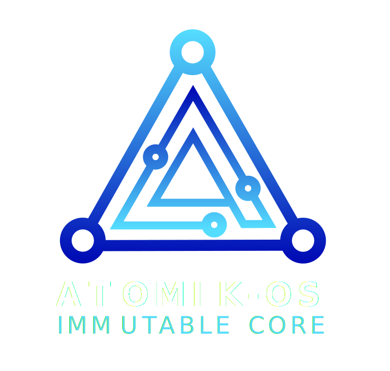

<p align="center">
  
</p>

<p align="center">
  <strong>Distribuzione Linux immutabile · Fedora Kinoite · KDE Plasma</strong>
</p>

<p align="center">
  <a href="#installazione">🇮🇹 Italiano</a> · <a href="#installation">🇬🇧 English</a>
</p>

---

# Atomik OS

Distribuzione Linux immutabile basata su **Fedora Kinoite**, con **KDE Plasma** come ambiente desktop. Progettata per workstation personali, gaming e virtualizzazione.

## Varianti

| Variante | Base | Uso | Stato |
|---|---|---|---|
| `atomik-desktop` | Fedora Kinoite 44 | Workstation generale (AMD/Intel) | ✅ Disponibile |
| `atomik-desktop-nvidia` | `atomik-desktop` | Workstation con GPU NVIDIA | ✅ Disponibile |
| `atomik-puregaming` | `atomik-desktop` | Gaming ottimizzato (AMD/Intel) | ✅ Disponibile |
| `atomik-puregaming-nvidia` | `atomik-desktop` | Gaming ottimizzato con GPU NVIDIA | ✅ Disponibile |
| `atomik-hypervisor` | `atomik-desktop` | Server di virtualizzazione (headless) | ✅ Disponibile |

Le varianti `puregaming`, `desktop-nvidia`, `puregaming-nvidia` e `hypervisor` ereditano tutto da `atomik-desktop`. Le modifiche al desktop si propagano automaticamente a tutte le derivate.

Per dettagli su ogni variante:
- [🖥 Desktop](docs/desktop.md)
- [🎮 PureGaming](docs/puregaming.md)
- [🖥 Hypervisor](docs/hypervisor.md)
- [🖧 Server](docs/server.md)

---

## Installazione

### Requisiti

- Sistema Fedora Kinoite installato (vanilla)
- Connessione internet
- CPU x86-64-v3 o superiore

> Verifica la compatibilità CPU: `/lib64/ld-linux-x86-64.so.2 --help | grep supported`

### Procedura

**1. Installa Fedora Kinoite** dalla [pagina ufficiale](https://fedoraproject.org/kinoite/) e completa la configurazione base.

**2. Esegui il comando di installazione:**

```bash
curl -fsSL https://giurestlabs.it/get-atomik | bash
```

Il wizard ti guida nella scelta della variante e completa l'installazione automaticamente.

**3. Riavvia** — al primo login il sistema configura automaticamente:
- Tema KDE Plasma (Breeze Dark + profilo Fast)
- Wallpaper Atomik OS (desktop, greeter e schermata di blocco)
- Shell Fish con configurazione Atomik
- App Flatpak di base (Telegram, Flatseal, RustDesk, Faugus, Bazaar, Gear Lever)
- Homebrew per tool CLI aggiuntivi

### Sicurezza installer

Il wrapper `get-atomik.sh` verifica l'integrità di `atomik-install.sh` tramite:
- **SHA256** automatico (aggiornato dal CI ad ogni modifica)
- **Firma GPG** con chiave pubblica pubblicata indipendentemente su `giurestlabs.it/atomik-os/pubkey.gpg`

La chiave privata non è mai nel repo — un attaccante che compromette solo GitHub non può firmare versioni malevole.

---

## Comandi di sistema (ujust)

Atomik include `ujust`, una raccolta di comandi per le operazioni comuni. Lancia `ujust` senza argomenti per la lista completa.

```bash
ujust update           # aggiorna il sistema (bootc upgrade)
ujust status           # stato dell'immagine bootc corrente
ujust rollback         # torna all'immagine precedente
ujust changelog        # novità dell'ultimo aggiornamento
ujust sshauth-config   # configura autenticazione SSH verso l'hypervisor
ujust vm-console VM    # apre la console SPICE di una VM
ujust brew-setup       # installa Homebrew (tool CLI utente)
```

---

## Software incluso

### Base (presente su tutte le varianti)

- **Desktop**: KDE Plasma 6 (Kinoite)
- **Profilo**: Fast (effetti disabilitati, massima reattività)
- **Tema**: Breeze Dark
- **Terminale**: Konsole + Fish + Starship
- **Browser**: Brave (nativo, debloated)
- **Store app**: Bazaar (Flatpak)
- **Boot**: Plymouth con tema Atomik
- **CLI tools**: Homebrew, fastfetch
- **Container**: podman, distrobox
- **App Flatpak base**: Telegram, Flatseal, RustDesk, Faugus, Gear Lever

### PureGaming (in aggiunta alla base)

- **Overlay GPU**: MangoHud (per-gioco via Steam launch options)
- **Performance**: GameMode, sysctl gaming (swappiness, max_map_count)
- **Client di gioco**: Steam, Lutris (RPM); Heroic (Flatpak)
- **Comunicazione**: Discord, TeamSpeak3 (Flatpak)

### Hypervisor (in aggiunta alla base)

- **Virtualizzazione**: libvirt, QEMU/KVM, virt-manager
- **Gestione VM**: Cockpit + cockpit-machines (https://[IP]:9090)
- **Rete VM**: NAT default via virbr0, port forward via socat
- **Backup VM**: su NAS Synology via SMB

---

## Struttura repo

```
atomik-os/
├── .github/workflows/
│   ├── build.yml                     # Build immagini OCI → ghcr.io
│   └── update-installer-sha.yml      # Aggiorna SHA256 dell'installer
├── containerfiles/
│   ├── Containerfile.desktop         # Base (FROM Fedora Kinoite 44)
│   ├── Containerfile.puregaming      # FROM atomik-desktop
│   ├── Containerfile.desktop-nvidia  # FROM atomik-desktop + driver NVIDIA
│   ├── Containerfile.puregaming-nvidia # FROM atomik-desktop-nvidia
│   └── Containerfile.hypervisor      # FROM atomik-desktop
├── install/
│   ├── get-atomik.sh                 # Bootstrap con verifica GPG+SHA256
│   ├── atomik-install.sh             # Wizard installazione (whiptail)
│   └── atomik-install.sh.sha256      # Checksum (aggiornato dal CI)
├── files/
│   ├── branding/                     # Logo SVG/PNG, icone
│   ├── plasma/                       # Config KDE Plasma (skel, wallpaper)
│   ├── plymouth/atomik/              # Tema Plymouth
│   ├── fastfetch/                    # Config fastfetch per variante
│   ├── ujust/                        # Ricette ujust per variante
│   └── system/                       # File di sistema (servizi, script)
├── build_files_desktop_kn/           # Script di build variante desktop
├── build_files_nvidia/               # Script di build variante NVIDIA
├── build_files_puregaming/           # Script di build variante gaming
└── tools/
    └── atomik-bench                  # Suite benchmark universale
```

---

## Note tecniche

- Il sistema è **bootc/OSTree**: aggiornamenti atomici con `ujust update`, rollback con `ujust rollback`
- `/etc` e `/var` persistono tra gli aggiornamenti; `/usr` è immutabile
- `ID` in `/etc/os-release` resta `fedora` per compatibilità bootc
- Le app si installano come **Flatpak** (Bazaar/Flathub) o tramite **Homebrew** (tool CLI)
- Per aggiungere pacchetti RPM temporaneamente: `rpm-ostree install` (sconsigliato, rompe l'immutabilità)

---

## Build locale

```bash
# Richiede podman o buildah
buildah build -f containerfiles/Containerfile.desktop -t atomik-desktop:local .
```

> Le varianti ereditano da `ghcr.io/giurest/atomik-desktop:latest` — per buildarle localmente serve prima l'immagine desktop.

---

---

# Atomik OS — English

An immutable Linux distribution based on **Fedora Kinoite** with **KDE Plasma**. Designed for personal workstations, gaming, and virtualization.

## Variants

| Variant | Base | Use | Status |
|---|---|---|---|
| `atomik-desktop` | Fedora Kinoite 44 | General workstation (AMD/Intel) | ✅ Available |
| `atomik-desktop-nvidia` | `atomik-desktop` | Workstation with NVIDIA GPU | ✅ Available |
| `atomik-puregaming` | `atomik-desktop` | Optimized gaming (AMD/Intel) | ✅ Available |
| `atomik-puregaming-nvidia` | `atomik-desktop` | Optimized gaming with NVIDIA GPU | ✅ Available |
| `atomik-hypervisor` | `atomik-desktop` | Virtualization server (headless) | ✅ Available |

---

## Installation

### Requirements

- Fedora Kinoite installed (vanilla)
- Internet connection
- x86-64-v3 CPU or higher

> Check CPU compatibility: `/lib64/ld-linux-x86-64.so.2 --help | grep supported`

### Steps

**1. Install Fedora Kinoite** from the [official page](https://fedoraproject.org/kinoite/) and complete the basic setup.

**2. Run the install command:**

```bash
curl -fsSL https://giurestlabs.it/get-atomik | bash
```

The wizard guides you through variant selection and completes the installation automatically.

**3. Reboot** — at first login the system automatically configures:
- KDE Plasma theme (Breeze Dark + Fast profile)
- Atomik OS wallpaper (desktop, greeter and lock screen)
- Fish shell with Atomik configuration
- Base Flatpak apps (Telegram, Flatseal, RustDesk, Faugus, Bazaar, Gear Lever)
- Homebrew for additional CLI tools

### Installer security

The `get-atomik.sh` wrapper verifies `atomik-install.sh` integrity via:
- **SHA256** automatically updated by CI on every change
- **GPG signature** with public key published independently at `giurestlabs.it/atomik-os/pubkey.gpg`

The private key is never in the repo — an attacker who only compromises GitHub cannot sign malicious versions.

---

## System commands (ujust)

Atomik includes `ujust`, a collection of commands for common operations. Run `ujust` without arguments for the full list.

```bash
ujust update           # update the system (bootc upgrade)
ujust status           # current bootc image status
ujust rollback         # revert to previous image
ujust changelog        # what changed in the last update
ujust sshauth-config   # configure SSH authentication to the hypervisor
ujust vm-console VM    # open a VM's SPICE console
ujust brew-setup       # install Homebrew (user-level CLI tools)
```

---

## Included software

### Base (on all variants)

- **Desktop**: KDE Plasma 6 (Kinoite)
- **Profile**: Fast (effects disabled, maximum responsiveness)
- **Theme**: Breeze Dark
- **Terminal**: Konsole + Fish + Starship
- **Browser**: Brave (native, debloated)
- **App store**: Bazaar (Flatpak)
- **Boot**: Plymouth with Atomik theme
- **CLI tools**: Homebrew, fastfetch
- **Containers**: podman, distrobox
- **Base Flatpak apps**: Telegram, Flatseal, RustDesk, Faugus, Gear Lever

### PureGaming (in addition to base)

- **GPU overlay**: MangoHud (per-game via Steam launch options)
- **Performance**: GameMode, gaming sysctl (swappiness, max_map_count)
- **Game clients**: Steam, Lutris (RPM); Heroic (Flatpak)
- **Communication**: Discord, TeamSpeak3 (Flatpak)

### Hypervisor (in addition to base)

- **Virtualization**: libvirt, QEMU/KVM, virt-manager
- **VM management**: Cockpit + cockpit-machines (https://[IP]:9090)
- **VM networking**: NAT default via virbr0, port forwarding via socat
- **VM backup**: to Synology NAS via SMB

---

## Technical notes

- The system is **bootc/OSTree**: atomic updates with `ujust update`, rollback with `ujust rollback`
- `/etc` and `/var` persist across updates; `/usr` is immutable
- `ID` in `/etc/os-release` remains `fedora` for bootc compatibility
- Apps are installed as **Flatpak** (Bazaar/Flathub) or via **Homebrew** (CLI tools)
- To temporarily add RPM packages: `rpm-ostree install` (not recommended, breaks immutability)

---

## Local build

```bash
# Requires podman or buildah
buildah build -f containerfiles/Containerfile.desktop -t atomik-desktop:local .
```

> Variants inherit from `ghcr.io/giurest/atomik-desktop:latest` — to build them locally you need the desktop image first.
